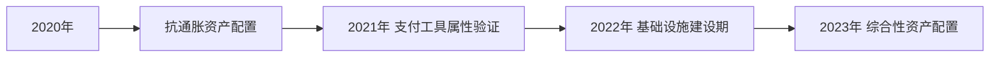

# 对冲基金Guggenheim入局比特币信托 华尔街日渐掌控定价权

## Guggenheim战略投资5亿美元比特币信托

美国知名资管机构古根海姆公司（Guggenheim Partners）近日向美国证券交易委员会提交重要文件，宣布将通过旗下"Macro Opportunities Fund"基金，将最多10%的资产净值（约合5.3亿美元）投入灰度比特币信托（Grayscale Bitcoin Trust）。这一举措标志着华尔街主流金融机构对加密资产的战略性布局进入新阶段。

值得注意的是，该基金投资标的为灰度专业管理的比特币信托产品，该信托基金采用单一资产配置模式，通过发行股票形式为投资者提供比特币间接投资渠道。Guggenheim在公告中将虚拟货币定义为"作为交换媒介的数字资产"，但明确表示当前暂无直接投资加密货币的计划。

👉 [探索加密货币投资新机遇](https://bit.ly/okx_welcome)

## 华尔街机构加速布局加密市场

### 机构投资者版图扩展
除Guggenheim外，多家顶级金融机构已率先布局：
- **Tudor Investment Corp**：Paul Tudor Jones旗下BVI Global Fund将资产的1-4%配置于比特币期货
- **Stanley Druckenmiller**：知名投资人于2023年11月公开透露已完成比特币配置
- **MicroStrategy**：累计持有超16万枚比特币，持仓市值达45亿美元

市场分析显示，机构投资者目前持有比特币总量已占流通量的50%以上。OKEx Research首席研究员William指出："本轮比特币上涨周期中，华尔街机构的资金流入量占据主导地位。"

### 货币政策驱动配置需求
全球主要央行持续实施量化宽松政策，导致债券实际收益率走低（2023年美国10年期国债实际收益率为-1.2%），推动机构投资者转向抗通胀资产。比特币因其抗审查、抗通胀特性，逐渐获得机构投资者认可，成为新型避险资产。

## 市场波动性与合规风险警示

### 极端波动性特征
Guggenheim在投资公告中特别提示，比特币具有"高度震荡"特性：
- 2020-2023年间年化波动率维持在50-80%区间
- 单日价格波动超10%的天数占比达3.7%
- 极端行情下24小时波动幅度可达25%

### 监管政策不确定性
合规风险成为机构投资者关注重点：
1. 各国央行可能出台限制性政策
2. 加密货币与主权货币竞争引发监管干预
3. 基础设施安全风险（交易所、钱包等）

全球最大对冲基金桥水基金创始人达利欧强调："比特币的高波动性及其与主流商品价格的弱关联性，限制了其作为理想价值存储工具的功能。"

## 专家视角：机构化趋势下的市场重构

### 市场结构演变
| 指标                | 2020年 | 2023年 |
|---------------------|--------|--------|
| 机构持仓占比        | 15%    | 52%    |
| 日均交易量（亿美元）| 300    | 850    |
| 合规交易平台数量    | 12     | 45     |

### 未来发展趋势
1. **产品创新**：现货比特币ETF获批概率升至75%
2. **技术升级**：Layer2解决方案推动交易效率提升
3. **合规框架**：全球主要经济体加速制定加密货币监管细则

👉 [了解更多合规加密货币平台](https://bit.ly/okx_welcome)

## FAQ：投资者常见问题解答

### Q：机构投资者入场对比特币价格有何影响？
A：机构资金具有规模效应和长期配置特征，有助于提升市场流动性（当前机构交易量占比已达63%），同时可能降低极端波动频率。

### Q：普通投资者应如何参与机构主导的加密市场？
A：建议通过合规渠道进行资产配置，关注机构持仓比例变化，合理控制仓位（建议不超过高风险资产的5-10%）。

### Q：比特币面临哪些主要竞争压力？
A：主要面临三方面竞争：
1. 央行数字货币（CBDC）的技术迭代
2. 稳定币市场份额争夺
3. 新兴公链项目的生态创新

### Q：当前市场是否存在泡沫风险？
A：从NVT（网络价值与交易量比值）指标看，当前值为58，低于2021年峰值142，处于历史45%分位，泡沫风险相对可控。

## 投资逻辑演变与市场展望

### 机构投资逻辑升级路径

### 市场关键支撑因素
- 全球支付场景渗透率提升（商户接受度年增47%）
- 技术基础设施完善（闪电网络节点数突破4.2万个）
- 机构服务生态成熟（合规托管解决方案增长300%）

## 持续关注市场动态演进

随着更多机构投资者入场，加密货币市场正在经历从散户主导到机构主导的结构性转变。投资者需重点关注监管政策走向、机构持仓变化及技术创新进展，在风险可控的前提下把握市场发展机遇。

👉 [获取实时加密货币市场数据](https://bit.ly/okx_welcome)