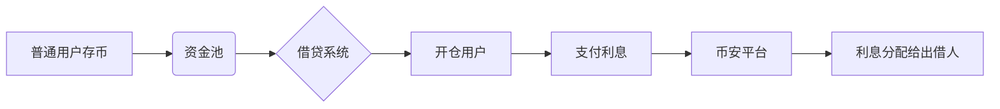

# 币安杠杆和合约有什么区别？

## 借币交易的核心逻辑

在数字货币交易中，杠杆交易的本质是通过借入资金放大投资规模。以狗狗币为例，当投资者判断其价格将上涨时，需通过币安杠杆功能借入USDT，用以购买更多狗狗币。具体操作流程如下：

1. **借入稳定币**：选择USDT作为借贷标的，通过抵押现有资产获取借贷额度
2. **现货买入**：将借入的USDT用于购买DOG/USDT交易对
3. **价差变现**：在价格上涨后卖出狗狗币，获取超额收益
4. **还本付息**：归还借入的USDT本金及应付利息

👉 [立即体验OKX杠杆交易](https://bit.ly/okx_welcome)

该交易模式手续费与普通现货交易完全一致（maker 0.1%，taker 0.1%），但需特别注意借贷产生的利息成本。通过BNB抵扣手续费功能，投资者可节省25%的交易成本。

## 杠杆资金池运作机制

币安杠杆交易的资金池由普通用户存币构成，借贷流程通过智能合约自动执行：

当用户持仓保证金率触及爆仓线（通常为5-7.5%）时，系统会自动平仓以保障出借方权益。这种机制有效避免了借贷双方的信用风险。

## 杠杆交易核心特性

| 特性维度       | 币安杠杆交易       | 常规现货交易       |
|----------------|--------------------|--------------------|
| 杠杆倍数       | 1-10倍             | 无杠杆             |
| 手续费标准     | maker 0.1% / taker 0.1% | 同左               |
| 利息成本       | 持仓期间持续产生   | 无                 |
| 资金流向       | 双向借贷市场       | 单向交易市场       |
| 资产所有权     | 涉及借入资产处置   | 完全自有资产交易   |

## 合约交易市场解析

与杠杆交易不同，币安合约市场属于衍生品交易范畴，其核心特征体现在：

1. **无实际资产交割**：交易标的是价格指数合约，不涉及实物资产转移
2. **资金费率机制**：每8小时结算多空资金费用，正负值由市场供需决定
3. **超高杠杆空间**：最高可达125倍，但对应爆仓风险呈指数级上升
4. **手续费结构**：maker 0.02% / taker 0.05%，按名义价值计算

👉 [探索OKX合约交易新体验](https://bit.ly/okx_welcome)

## 杠杆与合约关键差异

| 对比维度       | 币安杠杆交易       | 币安合约交易       |
|----------------|--------------------|--------------------|
| 市场属性       | 现货衍生市场       | 完全独立的衍生品市场 |
| 杠杆上限       | 10倍               | 125倍              |
| 手续费计算基准 | 实际交易金额       | 合约名义价值       |
| 利息支付       | 持续产生借贷利息   | 无利息但有资金费率 |
| 爆仓触发机制   | 保证金率触及平仓线 | 强制减仓/自动平仓  |
| 适用场景       | 中长期价值投资     | 短线投机套利       |

## 风险控制策略

根据顶级交易员Nachi的操作记录，建议采取以下风控措施：

1. **杠杆倍数控制**：实物杠杆不超过5倍，合约交易不超过20倍
2. **仓位管理**：单品种持仓不超过总资金的5%
3. **止盈止损**：设置动态止盈线（建议3%-5%）和止损线（不超过2%）
4. **资金费率监控**：定期检查合约资金费率变化趋势

👉 [获取OKX专业风控工具包](https://bit.ly/okx_welcome)

## 常见问题解答

### Q：杠杆交易适合哪些投资者？
A：适合有现货持仓需求，希望通过借贷放大收益的投资者。尤其适合对资产价格波动有较强判断能力的中长期持有者。

### Q：合约交易的资金费率如何计算？
A：资金费率每8小时结算一次，计算公式为：资金费用=名义价值×资金费率。当费率正值时，多头支付给空头；负值时空头支付给多头。

### Q：爆仓后能否恢复仓位？
A：一旦触发自动平仓，系统将强制关闭仓位且不可逆。建议在波动剧烈时保持充足保证金，或使用条件单提前锁定风险。

### Q：BNB抵扣手续费如何操作？
A：在币安APP中进入【钱包】-【手续费抵扣设置】，开启BNB支付选项。现货账户和合约账户需分别设置，抵扣比例分别为25%和10%。

### Q：如何选择杠杆倍数？
A：建议根据市场波动率调整：BTC等主流币种不超过20倍，山寨币建议5倍以内。参考顶级交易员Nachi的持仓记录，其平均杠杆倍数仅为3.2倍。

## 手续费优化方案

通过合理配置BNB资产，投资者可实现多重手续费减免：

1. **现货账户**：持有BNB可抵扣25%交易手续费
2. **合约账户**：划转BNB至合约账户享受10%费率优惠
3. **阶梯优惠**：VIP等级越高，BNB抵扣比例相应提升

需要注意的是，手续费计算基数为合约名义价值。例如使用100 USDT本金开100倍杠杆时，手续费计算基数为10,000 USDT，此时BNB抵扣效果将显著放大。

## 操作指南

1. **开通杠杆账户**：在币安APP中选择【钱包】-【杠杆】-【创建账户】
2. **划转保证金**：将目标交易币种划转至杠杆账户
3. **借贷操作**：在【借币】界面选择币种及数量
4. **开仓交易**：切换至现货交易界面进行买卖操作
5. **利息管理**：通过【利息历史】查看实时借贷成本

在合约交易界面，可通过【资金费率】标签查看实时费率变化，合理安排持仓周期。建议使用OKX提供的[智能风控系统](https://bit.ly/okx_welcome)实时监控市场波动，及时调整仓位配置。